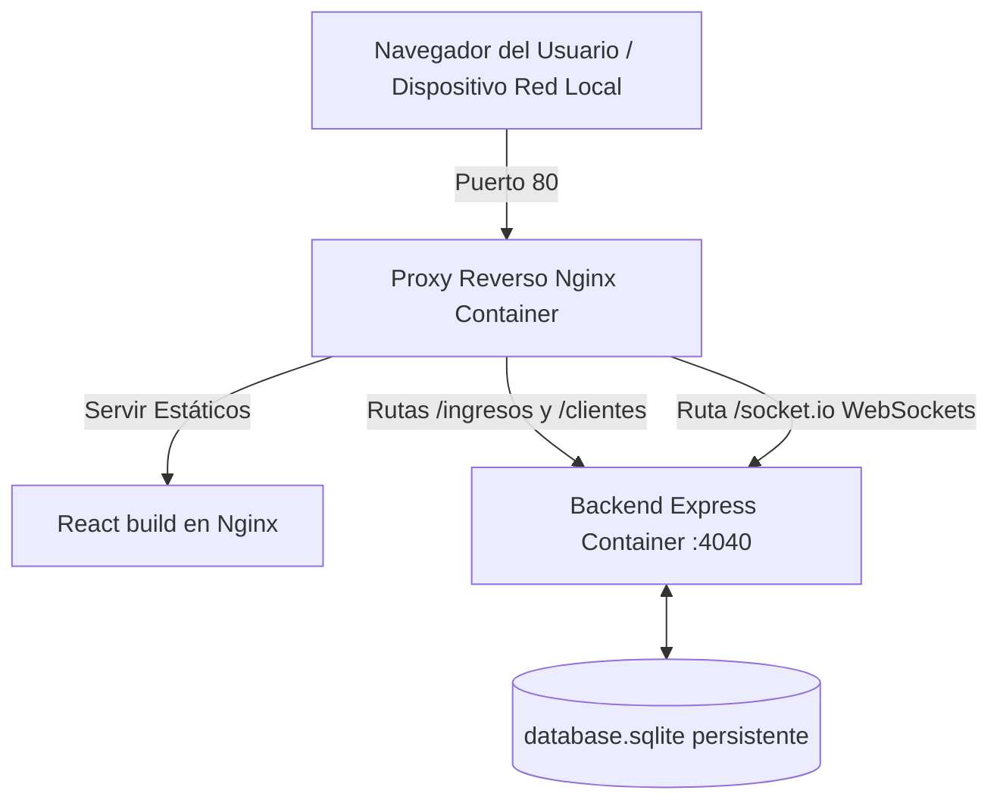

# Zero Informática — Sistema de Gestión de Servicio Técnico

Un sistema de gestión moderno, en tiempo real y autónomo diseñado específicamente para talleres de soporte y servicio técnico de computadoras, consolas y dispositivos electrónicos. 

Esta aplicación permite el control integral de ingresos, reparaciones, señas, estados y base de datos unificada de clientes frecuentes, todo sincronizado de forma instantánea entre múltiples dispositivos locales.

---

## 🚀 Características Clave

*   **Panel de Métricas en Tiempo Real (KPIs):** Indicadores visuales de servicios Pendientes, Reparados, Avisados y el total de servicios registrados.
*   **Buscador Global Inteligente:** Permite filtrar instantáneamente a través de todo el historial de servicios (más de 4,700 registros) por número de servicio, nombre del cliente, teléfono, marca, modelo o fecha.
*   **Sincronización Instantánea (WebSockets):** Si un técnico actualiza un estado en el taller o crea un nuevo ingreso, el cambio se refleja en las pantallas de todos los demás dispositivos conectados (PCs, móviles o tablets) sin necesidad de recargar la página.
*   **Gestión de Clientes Frecuentes:** Módulo dedicado para control de clientes, historiales de servicio vinculados e identificación automática al ingresar un equipo nuevo.
*   **Paginación Fluida:** Tablas optimizadas del lado del cliente tanto en computadoras de escritorio como en una vista adaptada en tarjetas para dispositivos móviles.
*   **Generador de Comprobantes PDF:** Creación automática de tickets de ingreso de equipos en PDF listos para imprimir y entregar al cliente.
*   **Estética Premium:** Interfaz de diseño moderno en modo oscuro con efectos de Glassmorphism (diseño translúcido), colores armoniosos y feedback interactivo mediante SweetAlert2.

---

## 🛠️ Tecnologías Utilizadas

### Frontend (Cliente SPA)
*   **React 17:** Librería base para la interfaz de usuario.
*   **Vite:** Herramienta de compilación ultrarrápida (HMR) que reemplaza los antiguos bundlers.
*   **Axios:** Cliente HTTP para comunicación REST.
*   **Socket.io-client:** Cliente para conexión por WebSockets en tiempo real.
*   **Bootstrap Icons & Custom Vanilla CSS:** Iconografía moderna y diseño responsivo adaptado con estilo propio.
*   **jsPDF & HTML2Canvas:** Generación y descarga de comprobantes en PDF.

### Backend (Servidor API REST)
*   **Node.js & Express.js:** Motor de servidor y enrutador de la API.
*   **sql.js:** Base de datos SQLite ligera y rápida ejecutada en memoria y persistida de manera asíncrona en disco (`database.sqlite`).
*   **Socket.io:** Servidor WebSocket integrado para la comunicación bidireccional en red local.

### Infraestructura y Despliegue
*   **Docker & Docker Compose:** Contenerización multi-contenedor.
*   **Nginx (Alpine):** Servidor web de alto rendimiento utilizado para servir los archivos estáticos del frontend y actuar como Proxy Reverso para redirigir las peticiones de API y WebSockets al backend.

---

## 📦 Arquitectura de Red y Producción

La aplicación está optimizada para desplegarse mediante Docker con una arquitectura de **Proxy Reverso de Nginx** en el puerto 80:



---

## 💻 Instrucciones de Instalación y Ejecución

### Opción A: Despliegue de Producción con Docker (Recomendado)
Para instalar y correr la aplicación en cualquier servidor o PC local en un par de minutos:

1. Asegúrate de tener instalado [Docker Desktop](https://www.docker.com/).
2. Clona este repositorio y abre una terminal en la raíz del proyecto.
3. Inicia el sistema con el siguiente comando:
   ```bash
   docker compose up -d --build
   ```
4. Ingresa a **`http://localhost`** desde el navegador.

*Nota: Para ver las instrucciones detalladas sobre cómo transferir carpetas limpias a otra computadora, importar base de datos existentes o configurar accesos fáciles en red local (ej. `http://service.local`), consulta la [Guía de Despliegue en Docker](file:///E:/Proyectos%20Claude/Service-app/Service-App/DOCKER_MIGRATION_GUIDE.md).*

---

### Opción B: Ejecución en Desarrollo (Local)

#### 1. Backend (API Services)
```bash
cd "API Services"
npm install
npm run dev
```
*Corre por defecto en `http://localhost:4040`.*

#### 2. Frontend (frontend-services)
```bash
cd "frontend-services"
npm install
npm run dev
```
*Corre por defecto en `http://localhost:5173`.*

---

## 🗄️ Scripts de Migración de Datos
La aplicación cuenta con tres scripts de utilidad ubicados en `API Services/scripts/` para la gestión e importación inicial de registros:

*   **`migrate-data.js`**: Migración directa de datos desde un clúster remoto de MongoDB hacia SQLite.
*   **`migrate-from-csv.js`**: Migración inteligente desde archivos de hoja de cálculo CSV con sanitización y limpieza de campos numéricos (precios, señas).
*   **`migrateClientes.js`**: Agrupador inteligente que analiza el historial de servicios, unifica clientes repetidos y vincula automáticamente sus identificadores de forma retroactiva.
